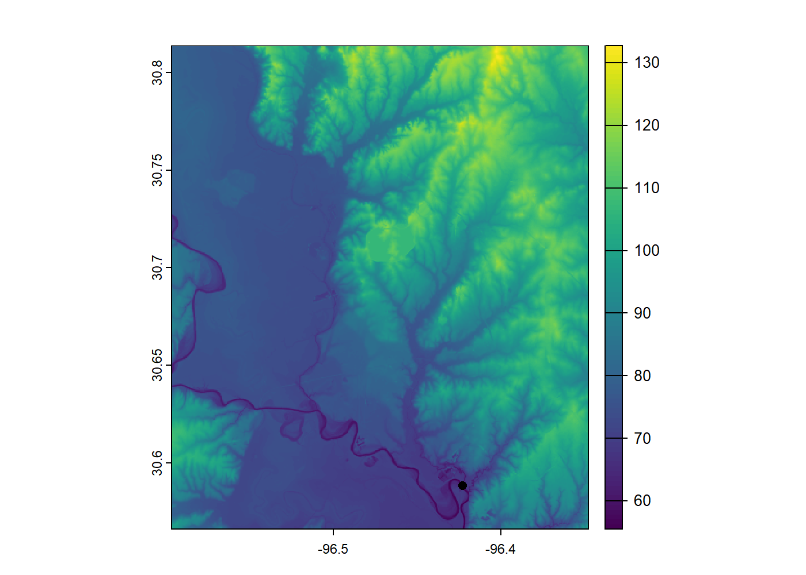

<!-- README.md is generated from README.Rmd. Please edit that file -->

# SELECTRshed

<!-- badges: start -->

[](https://lifecycle.r-lib.org/articles/stages.html#experimental)
<!-- badges: end -->

Delineate watersheds using whitebox tools and terra objects. These
functions are designed to interact kindly with {SELECTRdata} and
{SELECTR}. Largely a wrapper around the {whitebox} package.

## Installation

You can install the development version of SELECTRshed like so:

``` r
# FILL THIS IN! HOW CAN PEOPLE INSTALL YOUR DEV PACKAGE?
```

## Create Subbasins for SELECT

Pseudo-workflow goes like this:

    1 - Read DEM as a terra SpatRaster object
    2 - Read watershed outlet location as terra SpatVector object

    3 - Breach depressions in the DEM (from step 1)
    4 - Create a flow direction raster from DEM in step 3.
    5 - Create a flow accumulation raster from the flow direction raster in step 4.
    6 - Create a streams raster from the flow accumulation raster (step 5) and threshold for number of upstream cells.

    7 - Snap the vector pour point to the stream raster.
    8 - Rasterize the snapped vector pour point.
    9 - Delineate with flow direction raster and pour point raster.

    tbd: subbasins

``` r
library(SELECTRdata)
library(SELECTRshed)
#> Loading required package: whitebox
library(terra)
#> Warning: package 'terra' was built under R version 4.3.3
#> terra 1.8.29


gpkg <- system.file("extdata", "thompsoncreek.gpkg", package = "SELECTRdata")
dem <- system.file("extdata", "thompsoncreek.tif", package = "SELECTRdata")
dem <- terra::rast(dem)
pourpoint <- terra::vect(gpkg, layer = "pourpoint", crs = crs(dem))
plot(dem)
plot(pourpoint, add = TRUE)
```



Since this DEM is already filled, breached, and hydroenforced for NHD
delineations, this step isn’t necessary, but included anyways.

``` r
## breach depressions in the dem
breached <- create_breach_depression(dem)
## create the flow direction raster
fdr <- create_d8_pointer(breached)
## create teh flow accumulation raster
fa <- create_D8_fa(fdr)
## create the streams raster
streams_ras <- create_streams(fa, threshold = 10000)
plot(streams_ras, col = map.pal("viridis", 1))
```


``` r
## write pourpoints to temp folder
temp_pour_point_file <- paste0(tempdir(), "snapped.shp")
snapped_pour_point <- snap_pour_point(pour_pts = pourpoint,
                                      streams = streams_ras,
                                      output = temp_pour_point_file)

## the spatvectorproxy points to wrong file, might be a os path issue.
snapped_pour_point <- vect(temp_pour_point_file)
```

``` r

pour_point_rast <-  rasterize(snapped_pour_point, streams_ras)
```

``` r
watershed <- create_watershed(d8_pntr = fdr, 
                              pour_pts = pour_point_rast)
plot(watershed)
```


``` r
## clip d8_pntr and streams to watershed

fdr <- watershed * fdr
streams_ras <- watershed * streams_ras
subbasins <- create_subbasins(d8_pntr = fdr,
                              streams = streams_ras)
plot(as.factor(subbasins))
plot(as.polygons(streams_ras), add = TRUE)
```


### Other Notes

Why whitebox tools? Watersheding functions are available through the
terra and traudem packages, so why use whitebox?

- I’ve had difficulties getting reliable results using the recently
  added flow accumulation and related functions in terra. That is the
  only reason for this package.

- traudem can be difficult to install on some OS’s, whitebox seems
  readily available.

- You can accomplish all of this using functions available in the
  [whitebox]() R package. This is largely a wrapper that more easily
  allows the use of terra SpatRaster and SpatVector objects for users
  uncomfortable dealing with file paths or system commands.

- Really this is just to make a reproducible workflow for implementing
  SELECT in R.
